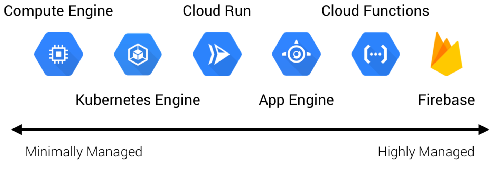
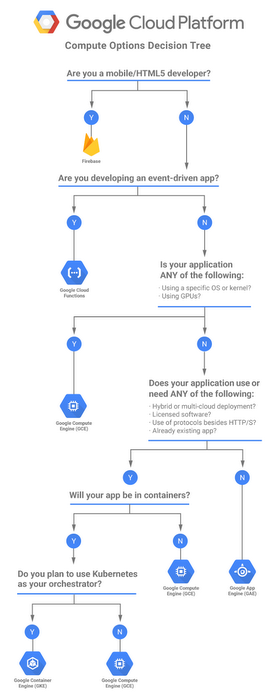

# GCP Compute Services

GCP offers a variety of compute options across a flexibility vs management scale. The following diagram shows services from highly managed to more configurable options

---

---

As seen from the above diagram Compute engine is minimally managed but a highly flexible service. In contrast Firebase/Cloud functions is a highly managed service but provides limited flexibility

***Note:*** The App Engine in the above diagram refers to App Engine Standard environment

---

## **Chossing the right compute enviornment**

Unfortunately there is no-right answer to this question.

### ***It Depends***

Google provides a good decision tree for making the right compute choice decision. The tree is pretty self-explanatory.

***Note:*** Knowing the ***limitations, deployment options & rollback options*** for each environment is crucial for the exam. 

---

---
