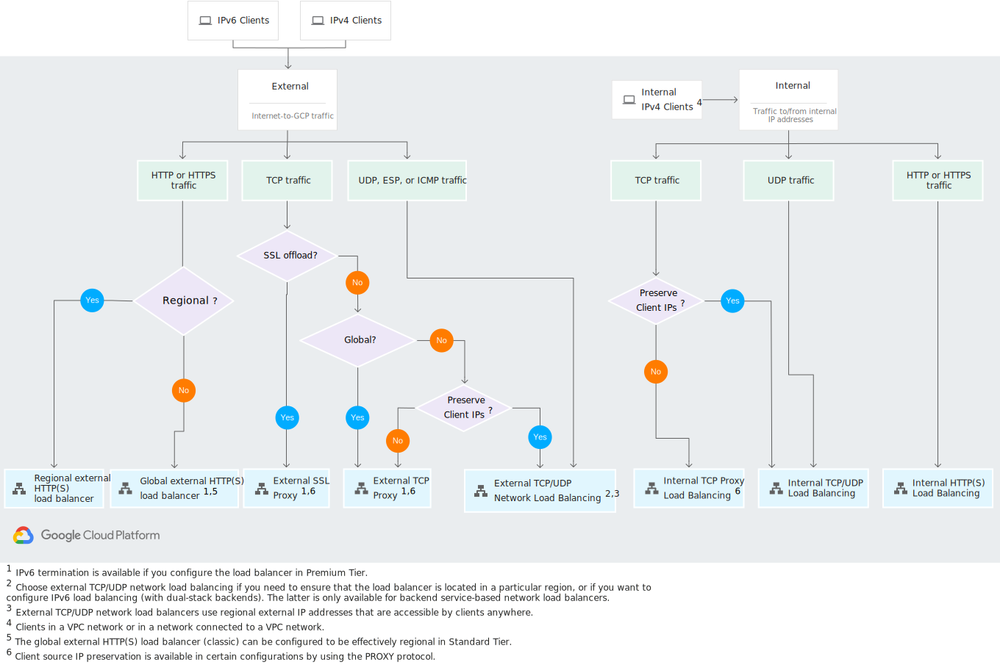

# Loadbalancers

GCP offers a variety of loadbalancing options. The key considerations for choice are ***Protocol(HTTP vs TCP vs UDP), External/Internal and Global/Regional***

The following diagram shows decision tree for choosing the right loadbalancer

---

---