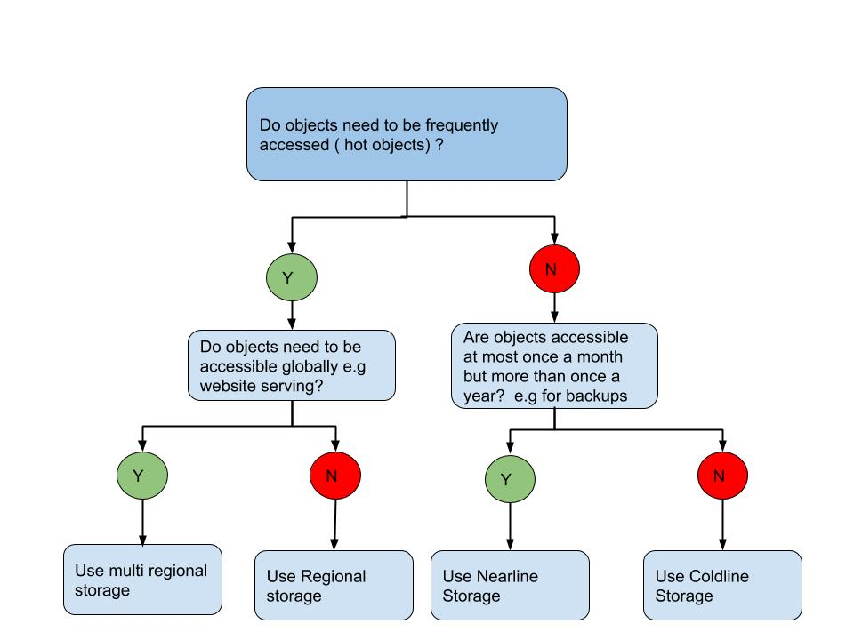

# Google Cloud Storage

## **Storage Classes**

Available in four classes
 - **Standard** Good for *hot* data
 - **Nearline** for infrequently accessed. *Less than once a month*
 - **Coldline** for *cold* data. *Less than once a quarter*
 - **Archive** for *archive* data. *Less than once a year*

Additional configuration option is the regional availabilty
 - **Regional** Data replicated across zones within a single region
 - **Dual-Regional** Data replicated across two regions
 - **Multi-Regional** Data replicated across multiple regions

 Data can be stored in any class with any regional configuration. e.g. Standard Multi-Region or Coldline-Regional

**Note:** Class can be set at individual object level within a Bucket, however regional/availability options ***CANNOT*** be different within the same bucket.

e.g. Bucket1 if configured to be a multi-regional bucket
 - object1 within Bucket1 can be set to coldline multi-regional
 - object1 however ***cannot*** be set to coldline dual-regional

---

***Object Lock*** can be configured to prevent accidental object deletion until a pre-defined date.

---

The following decision tree describes choosing the right storage class




---

## **Object Lifecycle**

Lifecycle rules can be set *at the bucket level*, defined in *JSON or XML* to 

 - Change the storage class of objects
 - Delete Objects
 - Manage versions of Objects

*Important Notes:*
 - Above rules apply to lifecycle management, *cannot* be used to change dual regional objects to regional.
 - Multiple rules can be applied to define different actions. e.g. change to coldline after 90 days and delete after 365 days

---

## Security

### **Access Control**

 - Access control for Google Cloud Storage Buckets can be enabled via GCP IAM or Access Control Lists

 - Google recommends using IAM over ACLs

 - IAM permissions follow the GCP hierarchy. Policy can be applied at Organisation, Folder, Project or Individual Bucket level.

*Note: Uniform bucket-level access when enabled on a bucket, ACLs are disabled and only bucket-level IAM permissions grant access to that bucket and the object it contains*

 - Permissions to GCS buckets can be granted to two special groups - *AllAuthenticatedUsers and AllUsers*

*Note:* VPC Service controls can be enabled to limit data exfiltration

 - **V4 Signed URL** can be used to grant time-limited access to a specific Cloud Storage resource

### **Logging**

Audit logs available in following types

 - Admin Activity Audit Logs: 
    - Enabled by default
    - Tracks Amin activity e.g. Creating/Deleting Buckets, Modifying ACLs

- Data Access Audit Logs:
    - Need to be explicitly enabled
    - Tracks data access e.g. reading/creating objects, reading metadata

### **Encryption**

 - Google encrypts all objects at rest in GCS buckets by default, using AES
 - Data can also be encrypted server side using
    - Customer Managed Encryption Keys
    - Customer Supplied Encryption Keys

 - Data can also be encrypted prior to upload, referred to as *Client Side Encryption*

---

## **GSUTIL**

gsutil is the command line for working with GCS. *Very Similar to Linux commmands*

Important commands:
 - **cp** for copying objects from source to destination
 - **ls** for listing objects
 - **rm** for removing/deleting objects
 - **mv** similar to linux, for moving objects
 - **mb** used to create buckets e.g ```gsutil mb gs://my-awesome-bucket```


**Note: -m flag can be used for multithreading gsutil operations**


---